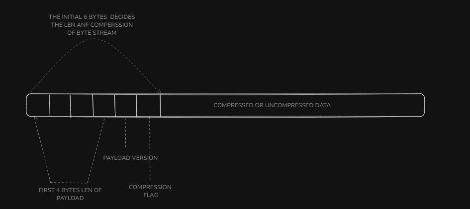
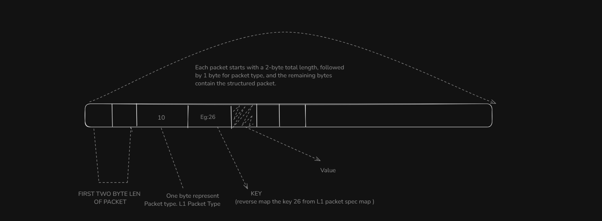

# NxTrad WebSocket Integration Overview

The NxTrad WebSocket delivers real-time data through a binary stream. Upon establishing a successful connection using the provided WebSocket URL, clients are required to send a valid subscription request. The server responds with compressed binary packets based on request types (L1, L5, OHLC, Market Status, Events, Ping, and Greeks).

Each WebSocket Payload begins with:

- **4 bytes**: Representing the payload length.
- **1 byte**: Indicating the version (expected value: 1).
- **1 byte**: Compression flag (100 if compressed).

<p align="center">
   
</p>

If the data is compressed, the remaining payload must be decompressed using zlib to extract individual packets. The request structure, its possible values, and the WebSocket URL are detailed in the sections below, Request sample has given below

### Decompression and Parsing

<p align="center">
   
</p>

1. **Decompress the Message:**  
   If the compression flag is enabled (value `100`), decompress the data using Zlib.

2. **Loop Over Packets:**
   - Read the **2-byte length** of each individual packet.
   - Read the **1-byte length** to identify the packet using the `PKT_TYPE` map.
   - Extract the packet and reverse-map to the appropriate handler based on packet type.

3. **Inside the Packets:**
   - Each packet begins with a **1-byte packet key**.
   - Use this key to reverse-map the structure from the packet’s `Packet Type` definition.
   - Read the value from the binary stream using the length and format defined in the spec.

### NxTrad WebSocket URL

To connect to the NxTrad WebSocket, construct the URL as follows:

```json
"wss://" + url + "/v2.1/stream?token=" + token + "&version=" + version

Use 3.0 as the version, and replace url and token with domain and access token
```

### REQUEST PAYLOAD

```json
{
  "type": "L1",
  "action": "sub", //[sub: lets you to subscribe for the symbol, usub: lets you to unsub the symbol]
  "tokens": [
    { "t": "-1_NSE" }, //symbols to get binary stream
    { "t": "22_NSE" }
  ],
  "chartInterval": "1M", // 5M, 30M supported
}
```

The possible values for  `type`  are listed below

| Type             | Description                                                                 |
|------------------|-----------------------------------------------------------------------------|
| `L1`             |L1 packet, gives you the real time feed,explained data in depth in Packet info section|
| `L5`             | Market depth data - top 5 levels of bid/ask ,explained data in depth in Packet info section|
| `L1S`            | Snapshot of feed |
| `L5S`            | Snapshot of top 5 depth data|
| `OHLC`           | Candle data with  `chartInterval` for periodic updates|
| `greeks`         | Real-time Greeks (Delta, Theta, Vega, etc.) for option contracts|
| `greeks-snapshot`| Snapshot of Greeks values|
| `event`          | For Real-time updation of order events such as position,orderbook, trade events|
| `PING`           | connectivity checks|

### SEG_INFO

| ID  | Exchange Segment | Precision | Divisor     |
|-----|------------------|-----------|-------------|
| 1   | NSE              | 2         | 100.0       |
| 2   | BSE              | 2         | 100.0       |
| 3   | NFO              | 2         | 100.0       |
| 4   | BFO              | 2         | 100.0       |
| 5   | CDS              | 4         | 10000000.0  |
| 6   | BCD              | 4         | 10000.0     |
| 7   | MCD              | 4         | 10000.0     |
| 8   | MCX              | 2         | 100.0       |
| 9   | NCO              | 2         | 10000.0     |
| 10  | BCO              | 2         | 10000.0     |

### PACKET INFO

#### PKT_TYPE

| Packet Type ID | Name           |
|----------------|----------------|
| 10             | L1             |
| 11             | L5             |
| 12             | OHLC           |
| 13             | AUTH           |
| 14             | MARKET_STATUS  |
| 15             | EVENTS         |
| 16             | PING           |
| 17             | GREEKS         |

#### L1 (Packet Type: 10)

| Byte Index | Data Type | Key         | Length | Description                        |
|------------|-----------|-------------|--------|------------------------------------|
| 26         | byte      | exchSeg     | 1      | Exchange segment identifier       |
| 27         | int       | token       | 4      | Unique token for the instrument   |
| 28         | byte      | precision   | 1      | Decimal precision for values      |
| 29         | int       | ltp         | 4      | Last traded price                 |
| 30         | int       | open        | 4      | Opening price                     |
| 31         | int       | high        | 4      | Highest price                     |
| 32         | int       | low         | 4      | Lowest price                      |
| 33         | int       | close       | 4      | Closing price                     |
| 34         | int       | chng        | 4      | Price change                      |
| 35         | int       | chngPer     | 4      | Percentage change                 |
| 36         | int       | atp         | 4      | Average traded price              |
| 37         | int       | yHigh       | 4      | Yearly high price                 |
| 38         | int       | yLow        | 4      | Yearly low price                  |
| 39         | unint       | ltq         | 4      | Last traded quantity              |
| 40         | unint       | vol         | 4      | Total traded volume               |
| 41         | double    | ttv         | 8      | Total traded value                |
| 42         | int       | ucl         | 4      | Upper circuit limit               |
| 43         | int       | lcl         | 4      | Lower circuit limit               |
| 44         | unint       | OI          | 4      | Open interest                     |
| 45         | int       | OIChngPer   | 4      | Open interest percentage change   |
| 46         | int       | ltt         | 4      | Last traded time                  |
| 49         | int       | bidPrice    | 4      | Best bid price                    |
| 50         | int       | qty         | 4      | Bid quantity                      |
| 51         | int       | no          | 4      | Number of bid orders              |
| 52         | int       | askPrice    | 4      | Best ask price                    |
| 53         | unint       | qty         | 4      | Ask quantity                      |
| 54         | int       | no          | 4      | Number of ask orders              |
| 55         | byte      | nDepth      | 1      | Depth of market                   |
| 56         | int       | nLen        | 2      | Length of additional data         |
| 58         | unint       | prevOI      | 4      | Previous open interest            |
| 59         | unint       | dayHighOI   | 4      | Day's highest open interest       |
| 60         | unint       | dayLowOI    | 4      | Day's lowest open interest        |
| 70         | int       | spotPrice   | 4      | Spot price                        |
| 71         | int       | dayClose    | 4      | Day's closing price               |
| 74         | int       | vwap        | 4      | Volume-weighted average price     |

#### L5 (Packet Type: 11)

| Byte Index | Data Type | Key         | Length | Description                        |
|------------|-----------|-------------|--------|------------------------------------|
| 26         | byte      | exchSeg     | 1      | Exchange segment identifier       |
| 27         | int       | token       | 4      | Unique token for the instrument   |
| 28         | byte      | precision   | 1      | Decimal precision for values      |
| 47         | unint       | totBuyQty   | 4      | Total buy quantity                |
| 48         | unint       | totSellQty  | 4      | Total sell quantity               |
| 49         | int       | price       | 4      | Best bid price                    |
| 50         | unint       | bid qty         | 4      | Bid quantity                      |
| 51         | unint       | no          | 4      | Number of bid orders              |
| 52         | int       | price       | 4      | Best ask price                    |
| 53         | unint       |ask qty         | 4      | Ask quantity                      |
| 54         | int       | no          | 4      | Number of ask orders              |
| 55         | byte      | nDepth      | 1      | Depth of market                   |

#### OHLC (Packet Type: 12)

| Byte Index | Struct | Key         | Length | Description                        |
|------------|--------|-------------|--------|------------------------------------|
| 26         | byte   | exchSeg     | 1      | Exchange segment identifier       |
| 27         | int    | token       | 4      | Unique token for the instrument   |
| 28         | byte   | precision   | 1      | Decimal precision for values      |
| 30         | int    | open        | 4      | Opening price                     |
| 31         | int    | high        | 4      | Highest price                     |
| 32         | int    | low         | 4      | Lowest price                      |
| 33         | int    | close       | 4      | Closing price                     |
| 40         | unint    | vol         | 4      | Total traded volume               |
| 46         | int    | time        | 4      | Timestamp of the data             |
| 74         | int    | vwap        | 4      | Volume-weighted average price     |
| 75         | string | type        | 4      | Type of data                      |
| 76         | unint    | minuteOi    | 4      | Minute-level open interest        |

#### AUTH (Packet Type: 13)

| Byte Index | Data Type | Key         | Length | Description                  |
|------------|-----------|-------------|--------|------------------------------|
| 25         | byte      | auth_status | 1      | Authentication status        |

#### MARKET_STATUS (Packet Type: 14)

| Byte Index | Data Type | Key          | Length | Description                  |
|------------|-----------|--------------|--------|------------------------------|
| 56         | short     | nLen         | 2      | Length of the market status  |
| 26         | byte      | exchSeg      | 1      | Exchange segment identifier  |
| 57         | byte      | marketStatus | 1      | Current market status        |

#### EVENTS (Packet Type: 15)

| Byte Index | Struct | Key     | Length | Description                  |
|------------|--------|---------|--------|------------------------------|
| 56         | short  | nLen    | 2      | Length of the message        |
| 61         | string | message | 100    | Dynamic length message field |

#### PING (Packet Type: 16)

| Byte Index | Data Type | Key   | Length | Description                  |
|------------|-----------|-------|--------|------------------------------|
| 62         | byte      | pong  | 1      | Pong response identifier     |

#### GREEKS (Packet Type: 17)

| Byte Index | Data Type | Key     | Length | Description                  |
|------------|-----------|---------|--------|------------------------------|
| 63         | double    | itm     | 8      | In-the-money value           |
| 64         | double    | iv      | 8      | Implied volatility           |
| 65         | double    | delta   | 8      | Rate of change of option price with respect to the underlying asset price |
| 66         | double    | gamma   | 8      | Rate of change of delta with respect to the underlying asset price |
| 67         | double    | theta   | 8      | Rate of change of option price with respect to time (time decay) |
| 68         | double    | rho     | 8      | Rate of change of option price with respect to interest rate |
| 69         | double    | vega    | 8      | Rate of change of option price with respect to volatility |
| 72         | double    | highiv  | 8      | Highest implied volatility   |
| 73         | double    | lowiv   | 8      | Lowest implied volatility    |
